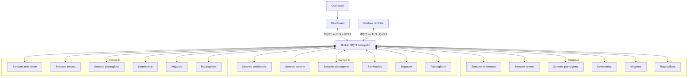
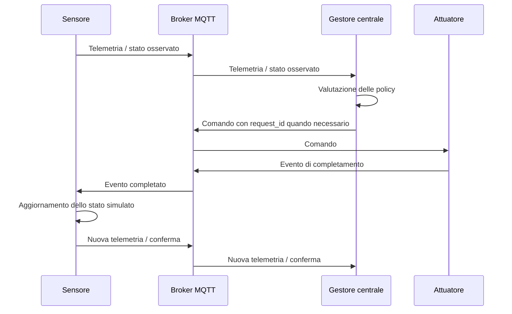

# Smart Farm

## Scopo

Questo progetto realizza una **Smart Farm simulata e distribuita**, composta da più servizi Docker che comunicano tramite MQTT. Il sistema rappresenta tre campi indipendenti (`field_a`, `field_b`, `field_c`) e simula condizioni ambientali, terreno, crescita delle colture, irrigazione, riossigenazione, semina e raccolta.

L'obiettivo principale del progetto è separare in modo chiaro le responsabilità dei componenti. I sensori osservano il mondo simulato, il Gestore centrale prende le decisioni, gli attuatori eseguono le azioni e la Dashboard presenta lo stato del sistema e permette all'operatore di inviare richieste manuali.

Il progetto è stato sviluppato come sistema didattico a microservizi, mantenendo il codice semplice, leggibile e facilmente verificabile tramite test Pytest.

## Responsabilità architetturali

Il sistema segue una regola principale:

```text
sensori = osservano e pubblicano lo stato
Gestore centrale = decide e orchestra
attuatori = eseguono le azioni
Dashboard = visualizza e invia intenzioni dell'operatore
MQTT Broker = collega i servizi
```

Un componente non deve assumere responsabilità appartenenti a un altro livello. Per esempio, il Terrain Sensor non decide di irrigare, il Gestore centrale non modifica direttamente l'umidità del terreno e la Dashboard non simula uno stato che non è stato osservato.

Questa separazione rende il flusso più semplice da comprendere e riduce il rischio di duplicare le azioni.

## Architettura del sistema

La Smart Farm è composta da un broker MQTT centrale, un Gestore centrale, una Dashboard e un insieme di sensori e attuatori replicati per ciascun campo.



Tutti i servizi applicativi usano lo stesso contratto di comunicazione MQTT e lo stesso modello di configurazione centralizzata.

## Moduli principali

| Modulo | Responsabilità |
|---|---|
| `ambient_sensor` | Simula temperatura, umidità dell'aria, meteo, pioggia, vento, radiazione, data e stagione |
| `terrain_sensor` | Mantiene e pubblica lo stato del terreno, inclusi tipo di suolo, umidità e ossigenazione |
| `plantation_sensor` | Mantiene lo stato della coltura, la crescita, la salute e il tempo al raccolto |
| `seeder` | Esegue la semina richiesta dal Gestore centrale |
| `irrigator` | Esegue irrigazione e riossigenazione e pubblica gli eventi di completamento |
| `harvester` | Esegue la raccolta e salva il risultato nel deposito persistente |
| `camp_manager` | Riceve le osservazioni, applica le policy automatiche e coordina gli attuatori |
| `dashboard` | Visualizza il sistema in italiano e permette all'operatore di inviare richieste |
| `mqtt-broker` | Fornisce il canale di comunicazione MQTT sicuro tra tutti i componenti |

Ogni servizio contiene un proprio `README.md` con dettagli specifici relativi alla logica interna, ai topic e alla configurazione.

## Logica e flusso dati

### Ciclo generale di controllo

Il sistema utilizza un ciclo chiuso basato su osservazione, decisione, azione e nuova osservazione.



Il Gestore centrale non considera una richiesta completata solo perché il comando è stato pubblicato. Quando possibile, attende una conferma osservabile dal sensore interessato.

### Ambiente e tempo simulato

L'Ambient Sensor è il proprietario dell'orologio della simulazione. Ogni campo mantiene una data simulata e produce condizioni atmosferiche coerenti con la stagione.

La Dashboard invia il comando `skip` direttamente all'Ambient Sensor perché il tempo simulato appartiene a questo componente. Il giorno corrente viene mostrato nella Dashboard solamente nella sezione **Meteo corrente**.

### Terreno, irrigazione e riossigenazione

Il Terrain Sensor riceve la telemetria ambientale e aggiorna naturalmente umidità e ossigenazione. Non esegue irrigazioni in autonomia.

Il flusso è:

```text
Terrain Sensor
    → pubblica umidità e ossigenazione
Gestore centrale
    → valuta le soglie
    → invia un comando all'Irrigatore
Irrigatore
    → esegue l'azione
    → pubblica un evento di completamento con request_id
Terrain Sensor
    → applica l'effetto
    → pubblica nuova telemetria con la conferma
Gestore centrale
    → chiude la richiesta pending corrispondente
```

Il `request_id` evita di confondere operazioni diverse o conferme appartenenti a richieste precedenti.

### Semina

Quando il campo è vuoto, il Gestore centrale può selezionare automaticamente una coltura dopo il numero di giorni configurato oppure può ricevere una richiesta manuale dalla Dashboard.

La scelta automatica considera, in ordine:

1. compatibilità con la stagione;
2. compatibilità con il terreno;
3. distanza dall'umidità minima richiesta;
4. nome della coltura come criterio stabile di spareggio.

Il Gestore centrale invia il comando alla Seminatrice. La Plantation Sensor osserva l'evento di semina e diventa la fonte di verità sullo stato della coltura.

### Crescita della coltura

La Plantation Sensor usa i dati ambientali e del terreno per determinare:

- presenza o assenza di una coltura;
- stadio di crescita;
- percentuale di avanzamento;
- salute della coltura;
- tempo residuo al raccolto.

Gli stati macchina restano in inglese per mantenere un contratto stabile tra i servizi. La Dashboard li converte in etichette italiane prima di mostrarli all'utente.

### Raccolta

Quando una coltura raggiunge lo stato pronto al raccolto, il Gestore centrale invia una richiesta all'Harvester.

L'Harvester è l'unico componente responsabile della persistenza del raccolto:

```text
Gestore centrale
    → richiede il raccolto
Harvester
    → esegue il raccolto
    → salva il deposito
    → pubblica l'evento harvested
Plantation Sensor
    → osserva l'evento
    → svuota il campo
```

Le tre repliche Harvester condividono la stessa directory dati. La scrittura del deposito usa un lock POSIX e una sostituzione atomica del file per evitare perdite di dati in caso di raccolte contemporanee.

### Dashboard e operatore

La Dashboard non modifica direttamente il mondo simulato. I comandi operativi vengono normalmente inviati al Gestore centrale, che mantiene la responsabilità decisionale.

Fanno eccezione i comandi legati all'orologio simulato, come `skip`, che vengono inviati direttamente all'Ambient Sensor.

La navigazione principale della Dashboard contiene:

```text
Panoramica
Stato Sistema
Notifiche Sistema
```

Le informazioni sono separate per contesto. La Panoramica riceve dati agronomici e meteo, mentre Stato Sistema riceve solamente informazioni tecniche relative a connessioni, heartbeat e topologia.

## Topic MQTT principali

I topic sono organizzati per campo e per responsabilità.

| Categoria | Topic principale |
|---|---|
| Ambiente | `camp/{field}/environment/telemetry` |
| Terreno | `camp/{field}/terrain/telemetry` |
| Piantagione | `camp/{field}/plantation/status` |
| Semina | `camp/{field}/seeder/cmd/plant` |
| Evento semina | `camp/{field}/plantation/event/seeded` |
| Irrigazione | `camp/{field}/irrigator/cmd/irrigate` |
| Riossigenazione | `camp/{field}/irrigator/cmd/reoxygenate` |
| Evento irrigazione | `camp/{field}/terrain/event/irrigated` |
| Evento riossigenazione | `camp/{field}/terrain/event/reoxygenated` |
| Raccolta | `camp/{field}/harvester/cmd/harvest` |
| Evento raccolta | `camp/{field}/plantation/event/harvested` |
| Stato Irrigatore | `camp/{field}/irrigator/status` |
| Stato del campo | `camp/{field}/system/status` |
| Stato Gestore centrale | `camp/manager/status` |
| Notifiche | `camp/notifications` |
| Log attività | `camp/activity_logs` |
| Suggerimenti colture | `camp/top_seeds` |
| Deposito raccolti | `camp/harvest_deposit` |

I sensori e gli attuatori che non possiedono già uno status periodico pubblicano anche un heartbeat dedicato sotto `camp/{field}/heartbeat/...`.

## Configurazione

La configurazione comune si trova in:

```text
config/farm.yaml
```

Ogni container monta lo stesso file in:

```text
/app/config/farm.yaml
```

Il caricamento segue la stessa precedenza in tutto il progetto:

```text
variabile d'ambiente Docker > valore in farm.yaml > valore di default del codice
```

Le variabili d'ambiente permettono di modificare un singolo container senza duplicare l'intera configurazione.

Le sezioni principali del file YAML sono:

- `farm`: nome della farm e campi disponibili;
- `mqtt`: broker, porta, utente, CA, QoS, keepalive e riconnessione;
- `simulation`: data iniziale e intervalli della simulazione;
- `fields`: proprietà iniziali specifiche dei campi;
- `terrain`: fattori relativi ai tipi di terreno;
- `environment`: configurazione stagionale del meteo;
- `automation`: soglie e regole del Gestore centrale;
- `health`: intervalli heartbeat e timeout;
- `irrigator`: tempi e parametri dell'attuatore;
- `dashboard`: porta e intervallo di polling;
- `crops`: catalogo comune delle colture.

La password MQTT non viene salvata in `farm.yaml`. Deve essere fornita come segreto di runtime tramite:

```text
MQTT_BROKER_PASS
```

Il file `.env` contiene solamente la password necessaria ad MQTT per funzionare correttamente.

## Persistenza

Il progetto usa file JSON solamente dove è necessario mantenere dati oltre il ciclo del singolo messaggio.

| Componente | Persistenza |
|---|---|
| Gestore centrale | `camp_manager/data/daily_farm_log.json` per i report giornalieri |
| Harvester | `harvester/data/harvest_deposit.json` per la cronologia dei raccolti |

Gli altri stati principali sono mantenuti in memoria e ricostruiti tramite il normale flusso MQTT della simulazione.

## Dashboard e localizzazione

L'interfaccia utente è rappresentata in italiano. Gli stati macchina MQTT restano invece in inglese perché fanno parte del contratto interno tra servizi.

La Dashboard contiene mappe di traduzione centralizzate per convertire, tra gli altri:

- stati di crescita;
- salute delle colture;
- stato dei servizi;
- stato generale del sistema;
- operazioni dell'Irrigatore;
- eventi e comandi;
- stagioni e condizioni meteorologiche.

Un valore macchina sconosciuto non viene mostrato direttamente all'utente: viene rappresentato con un fallback italiano come `Sconosciuto` o `Sconosciuta`.

La Dashboard espone API separate per le diverse viste, evitando di trasferire informazioni tecniche dove non sono necessarie.

## Struttura del progetto

```text
.
├── ambient_sensor/
├── terrain_sensor/
├── plantation_sensor/
├── seeder/
├── irrigator/
├── harvester/
├── camp_manager/
├── dashboard/
├── config/
│   └── farm.yaml
├── tests/
├── docker-compose.yml
├── mqtt_tls_healthcheck.py
├── run_tests.sh
└── .env
```

Ogni servizio Python contiene normalmente:

```text
service/
├── src/
│   ├── common/
│   ├── core/
│   ├── utils/
│   └── main.py
├── tests/
├── Dockerfile
├── requirements.txt
└── README.md
```

La Dashboard mantiene una struttura leggermente diversa perché include anche `static/` e `templates/` per l'interfaccia web.

## Dipendenze

Le principali tecnologie utilizzate dal sistema sono:

- **Python 3** per i servizi applicativi;
- **aiomqtt** per la comunicazione MQTT asincrona;
- **Eclipse Mosquitto** come broker MQTT;
- **PyYAML** per la configurazione centralizzata;
- **Docker e Docker Compose** per isolamento e orchestrazione;
- **Pytest** per i test di regressione;
- **HTML, CSS e JavaScript** per la Dashboard;
- librerie standard Python per HTTP, concorrenza e persistenza locale.

Alcuni moduli possiedono dipendenze specifiche documentate nel relativo `README.md`.

## Sicurezza e affidabilità

### TLS

Tutte le connessioni MQTT applicative usano TLS verificato. Il client:

- carica la CA configurata;
- verifica il certificato del broker;
- verifica l'hostname;
- usa almeno TLS 1.2 per configurazione predefinita;
- non utilizza fallback MQTT non cifrato.

Il certificato del broker deve quindi essere valido anche per il nome DNS usato dai container, normalmente `mqtt-broker`.

### MQTT QoS

Il progetto impone **QoS 2** per i flussi MQTT applicativi principali. Questo è il livello massimo previsto dal protocollo MQTT per la consegna dei messaggi.

I client usano inoltre:

- identificativi stabili;
- `clean_session=False` per le sessioni applicative persistenti;
- keepalive configurabile;
- ciclo continuo di riconnessione.

### Healthcheck Docker

Il broker viene considerato healthy solamente dopo una pubblicazione MQTT autenticata su TLS.

I container applicativi usano `mqtt_tls_healthcheck.py`, che esegue una vera connessione MQTT su TLS e una chiusura regolare della sessione. Il controllo non usa una semplice apertura di socket TCP, perché questa non sarebbe sufficiente per verificare autenticazione e protocollo MQTT.

### Heartbeat

La pagina **Stato Sistema** utilizza heartbeat e status periodici per determinare la disponibilità dei componenti.

Sono monitorati:

- Ambient Sensor;
- Terrain Sensor;
- Plantation Sensor;
- Seeder;
- Harvester;
- Irrigator tramite il proprio status periodico;
- Gestore centrale tramite `camp/manager/status`.

Gli heartbeat contengono un timestamp della sorgente, così un vecchio messaggio retained non viene considerato indefinitamente valido.

## Test

Ogni modulo contiene una directory `tests/` con test Pytest a bassa complessità. I test raggiungono il codice applicativo con la convenzione:

```python
import sys
sys.path.append("src")
```

Per eseguire i test di un singolo servizio:

```bash
cd terrain_sensor
pytest -q
```

Per eseguire la suite dei moduli principali dalla root del progetto:

```bash
./run_tests.sh
```

Sono inoltre presenti test globali nella directory root `tests/` per verificare convenzioni comuni e invarianti critici, come TLS, QoS, healthcheck e responsabilità tra servizi.

I test applicativi sono progettati per verificare principalmente funzioni core e contratti senza richiedere un broker reale, in modo da mantenere la suite veloce e riproducibile.

## Avvio in Docker

### 1. Configurare la password MQTT

Aprire il file `.env` 

Impostare quindi `MQTT_BROKER_PASS` con la stessa password configurata nel file password di Mosquitto.

### 2. Preparare certificati e configurazione Mosquitto

Il Compose si aspetta i certificati nella directory:

```text
./certs
```

La configurazione del broker viene montata da:

```text
./mosquitto/config
```

Il certificato server deve essere valido per il nome DNS `mqtt-broker` utilizzato nella rete Docker.

Il file password di Mosquitto deve avere ownership e permessi compatibili con l'immagine del broker. È consigliato mantenerlo leggibile solamente dall'utente Mosquitto.

### 3. Costruire e avviare il sistema

```bash
./start.sh
```

Per osservare i log:

```bash
docker compose logs -f
```

La Dashboard viene esposta localmente sulla porta configurata, normalmente:

```text
http://localhost:8501
```

### 4. Arrestare il sistema

```bash
docker compose down
```